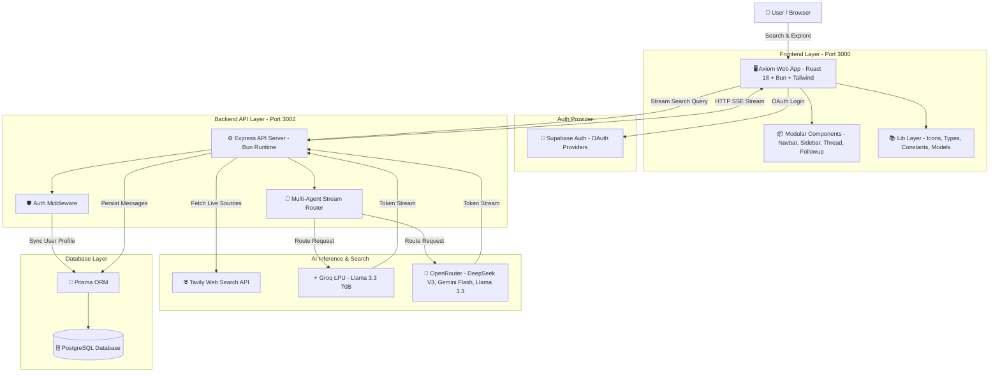

# 🔍 Axiom Search
> **Next-Generation Conversational AI Research Engine** — Delivers real-time, well-cited answers by combining live web retrieval with a multi-agent AI framework (Groq LPU + OpenRouter), wrapped in an obsidian glassmorphic interface.

---

## 🌟 Overview

**Axiom Search** is an open-source, full-stack AI search and research assistant built for speed, depth, and precision. When you submit a query, Axiom:
1. **Performs Deep Web Retrieval:** Executes real-time web searches via **Tavily** to collect authoritative, structured sources.
2. **Multi-Agent Reasoning:** Routes the synthesized context through your choice of multi-agent LLMs across **Groq** (LPU inference) and **OpenRouter** (DeepSeek V3, Gemini 2.0 Flash, Llama 3.3).
3. **Contextual Inline Citations:** Injects numerical citations (`[1]`, `[2]`) mapped directly to interactive source carousel cards with automatic domain extraction and preview favicons.
4. **Multi-Turn Contextual Follow-ups:** Maintains full conversational context across follow-up queries with persistent history.
5. **Hybrid Persistence:** Provides instant guest mode with `localStorage` fallback alongside authenticated **PostgreSQL + Prisma ORM** cloud synchronization.
6. **Obsidian Glassmorphism:** Features a custom dark aesthetic with dynamic atmospheric lighting, titanium accents, and the embossed Dragon Axiom medallion.

---

## 🏗️ System Architecture



---

## ⚡ Tech Stack

| Layer | Technologies & Tools | Purpose |
| :--- | :--- | :--- |
| **Frontend** | **React 18**, **TypeScript**, **Tailwind CSS v4** | Modular glassmorphism UI with real-time token streaming and reactive layout |
| **Bundler & Runtime** | **Bun (v1.2+)** | Native high-speed TypeScript bundler, HMR dev server, and package manager |
| **Icons & Media** | **Custom Dragon Medallion SVG**, **Lucide Icons** | Bespoke vector branding and UI iconography |
| **Backend API** | **Express 5**, **TypeScript**, **Bun** | Token-streaming API endpoints with robust error recovery and SSE headers |
| **Multi-Agent AI** | **Groq LPU Hardware** + **OpenRouter API** | Multi-model routing (Llama 3.3 70B, DeepSeek V3, Gemini 2.0 Flash) via Vercel AI SDK |
| **Live Web Crawl** | **Tavily Search API** | Real-time web retrieval, content scraping, and domain extraction |
| **Database & ORM** | **Prisma ORM** + **PostgreSQL** (Supabase DB) | Schema modeling, connection pooling, and atomic persistence |
| **Authentication** | **Supabase Auth** | Multi-provider OAuth with secure Bearer JWT verification and guest search support |

---

## 🤖 Available AI Models

Axiom features a multi-agent model selector allowing you to switch inference providers on the fly:

| Model | Provider | Badge | Ideal For |
| :--- | :--- | :---: | :--- |
| **Fast Groq Llama 3.3 70B** | Groq (LPU) | ⚡ | Ultra-fast token throughput & deep synthesis |
| **Reasoning DeepSeek V3** | OpenRouter | 🧠 | In-depth logical analysis & complex problem solving |
| **Smart Gemini 2.0 Flash** | OpenRouter | ✨ | Multimodal capabilities & structured summaries |
| **Open Llama 3.3 Free** | OpenRouter | 🦙 | Reliable open-source instruction following |

---

## 📁 Repository Structure

```
Axiom-Search/
├── server/                     # Backend API (Express 5, Bun, Prisma, AI Agents)
│   ├── agents/                 # Multi-agent streaming drivers
│   │   ├── groq.ts             # Groq SDK provider
│   │   ├── openrouter.ts       # OpenRouter AI SDK provider
│   │   └── index.ts            # Agent stream dispatcher
│   ├── lib/
│   │   ├── client.ts           # Supabase backend client
│   │   └── db.ts               # Prisma PostgreSQL adapter client
│   ├── prisma/
│   │   ├── migrations/         # Migration history
│   │   └── schema.prisma       # Database models (User, Conversation, Message)
│   ├── index.ts                # Express streaming & conversation routes
│   ├── middleware.ts           # Optional & required JWT auth middleware
│   ├── prompt.ts               # System prompt & indexed citation formatter
│   ├── .env                    # Backend API keys & database credentials
│   └── package.json
│
├── web/                        # Frontend Application (React 18, Bun, Tailwind CSS)
│   ├── src/
│   │   ├── components/         # Modular React UI components
│   │   │   ├── Navbar.tsx      # Top frosted glassbar & share button
│   │   │   ├── Sidebar.tsx     # Collapsible history sidebar with auth controls
│   │   │   ├── HeroSearch.tsx  # Landing search hero with model selector
│   │   │   ├── MessageThread.tsx # Streaming thread, sources carousel & markdown
│   │   │   └── FollowupBar.tsx # Pinned bottom follow-up input
│   │   ├── lib/
│   │   │   ├── supabase/       # Supabase browser auth client
│   │   │   ├── constants.ts    # Model definitions & suggestions
│   │   │   ├── icons.tsx       # Dragon Axiom Emblem & vector icons
│   │   │   └── types.ts        # TypeScript interfaces & types
│   │   ├── pages/
│   │   │   ├── Home.tsx        # Main search & multi-turn orchestrator
│   │   │   └── Auth.tsx        # Supabase OAuth sign-in page
│   │   ├── App.tsx             # React Router configuration
│   │   ├── config.ts           # Backend URL configuration
│   │   ├── index.css           # Glassmorphism & dynamic lighting stylesheets
│   │   └── logo.svg            # Standalone Dragon Axiom vector badge
│   ├── build.ts                # Production asset bundler
│   ├── .env                    # Supabase public credentials
│   └── package.json
│
└── README.md                   # Project Documentation
```

---

## ⚡ Quickstart Guide

### Prerequisites
- [Bun](https://bun.sh/) (`v1.2+`)
- [Tavily API Key](https://tavily.com/)
- [Groq API Key](https://console.groq.com/)
- [OpenRouter API Key](https://openrouter.ai/)
- [Supabase Project](https://supabase.com/) (PostgreSQL & OAuth)

---

### 1. Clone the Repository
```bash
git clone https://github.com/SanidhyaGupta-10/Axiom-Search.git
cd Axiom-Search
```

---

### 2. Configure & Start Backend Server

```bash
cd server
bun install
```

Create `server/.env`:
```env
# AI Providers & Search
GROQ_API_KEY="your_groq_key"
OPENROUTER_API_KEY="your_openrouter_key"
TAVILY_API_KEY="your_tavily_key"

# Database & Supabase
DATABASE_URL="your_db_url"
SUPABASE_ANON_KEY="your_anon_key"
SUPABASE_SERVICE_ROLE_KEY="your_service_role_key"

PORT=3002
```

Generate Prisma client and launch:
```bash
bunx prisma generate
bun run --watch index.ts
```
> Server running at: **`http://localhost:3002`**

---

### 3. Configure & Start Web Client

Open a second terminal:
```bash
cd web
bun install
```

Create `web/.env`:
```env
VITE_SUPABASE_URL="your_supabase_url"
VITE_SUPABASE_ANON_KEY="your_anon_key"
```

Start the frontend:
```bash
bun run dev
```
> Web client running at: **`http://localhost:3000`**

---

## 🎯 Key Features

- **🌐 Real-Time Web Search:** Live web crawler via Tavily delivering fresh, relevant results.
- **⚡ Multi-Agent Intelligence:** Seamlessly switch between Groq (70B) and OpenRouter (DeepSeek V3, Gemini Flash, Llama 3.3).
- **📑 Inline Citation Mapping:** Every statement references indexed numbers `[1]`, `[2]` linked to source cards.
- **💬 Multi-Turn Follow-Ups:** Seamless conversational memory allowing endless follow-up exploration.
- **📚 Persistent History:** Searches immediately appear under **Recent Searches** in the collapsible sidebar.
- **🔒 Guest & Authenticated Modes:** Instant exploration without login (via `localStorage`), plus cloud sync with Google/GitHub OAuth via Supabase.
- **🎨 Obsidian Glassmorphism:** Crafted dark theme with dynamic atmospheric background lighting, titanium badges, and dragon vector emblem.

---

## 📄 License

Distributed under the MIT License.
