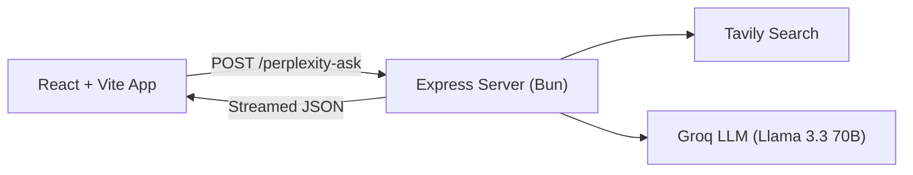

# 🔍 Axiom Search

An AI-powered research assistant that delivers precise, well-cited answers by combining real-time web search with LLM synthesis — inspired by Perplexity AI.

## Overview

Axiom Search takes a user query, performs an advanced web search via [Tavily](https://tavily.com/), feeds the results through a carefully engineered prompt to [Groq](https://groq.com/) (Llama 3.3 70B), and streams back a structured response with inline citations and follow-up questions.

## Architecture



## Tech Stack

| Layer      | Technology                                     |
| ---------- | ---------------------------------------------- |
| **Frontend** | React 19, Vite 8, TypeScript                 |
| **Backend**  | Express 5, Bun, TypeScript                   |
| **AI/LLM**   | Vercel AI SDK, Groq (Llama 3.3 70B Versatile) |
| **Search**   | Tavily API (advanced depth)                  |
| **Validation** | Zod (structured output schema)             |

## Project Structure

```
Axiom-Search/
├── server/              # Backend API
│   ├── index.ts         # Express server & /perplexity-ask endpoint
│   ├── prompt.ts        # System prompt & prompt template
│   ├── .env             # API keys (TAVILY, GROQ)
│   └── package.json
├── web/                 # Frontend app
│   ├── src/
│   │   ├── App.tsx      # Main React component
│   │   ├── App.css
│   │   ├── index.css
│   │   └── main.tsx     # Entry point
│   ├── index.html
│   ├── vite.config.ts
│   └── package.json
└── README.md
```

## Getting Started

### Prerequisites

- [Bun](https://bun.sh/) (runtime & package manager)
- [Tavily API Key](https://tavily.com/)
- [Groq API Key](https://console.groq.com/)

### 1. Clone the repository

```bash
git clone https://github.com/your-username/Axiom-Search.git
cd Axiom-Search
```

### 2. Set up the server

```bash
cd server
bun install
```

Create a `.env` file in `server/`:

```env
TAVILY_API_KEY=your_tavily_api_key
GROQ_API_KEY=your_groq_api_key
```

### 3. Set up the frontend

```bash
cd web
bun install
```

### 4. Run the app

Start the backend:

```bash
cd server
bun run index.ts
```

Start the frontend (in a separate terminal):

```bash
cd web
bun run dev
```

The server runs on `http://localhost:3000` and the frontend on `http://localhost:5173`.

## API

### `POST /perplexity-ask`

Send a research query and receive a streamed, cited answer.

**Request:**

```json
{
  "query": "What are the performance benchmarks of Bun vs Node.js?"
}
```

**Response** (streamed JSON):

```json
{
  "answer": "Markdown-formatted answer with [1], [2] inline citations...",
  "followUps": [
    "How does Bun handle TypeScript compilation compared to ts-node?",
    "What are the memory usage differences between Bun and Node.js?",
    "Which frameworks have native Bun support?"
  ]
}
```

## License

MIT
